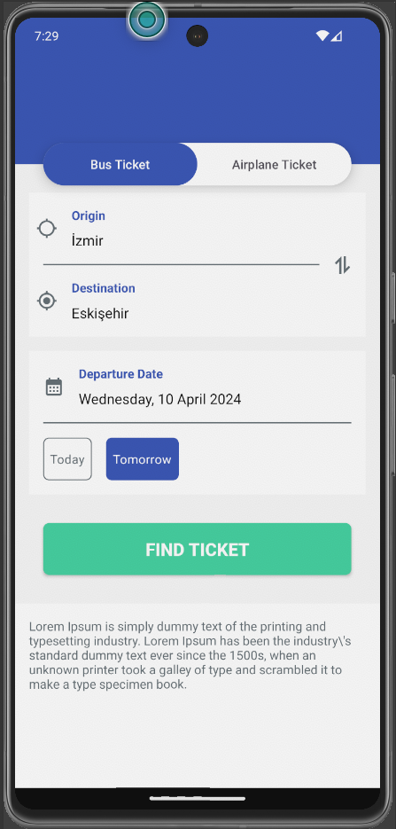
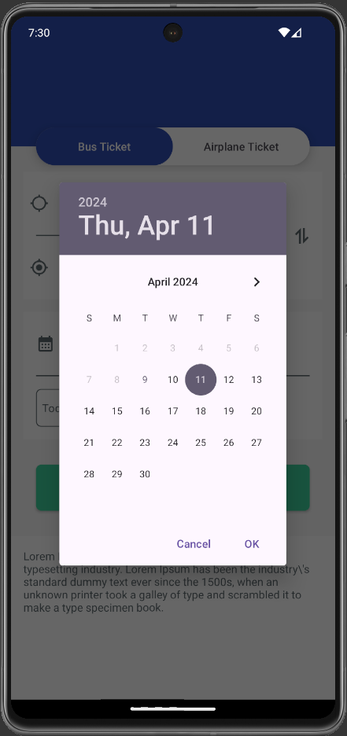
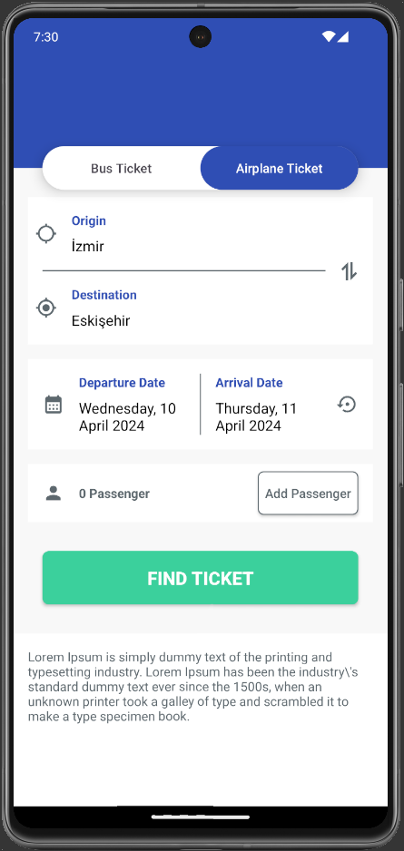
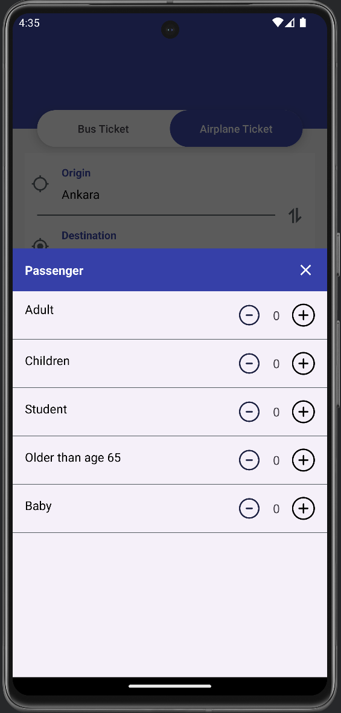
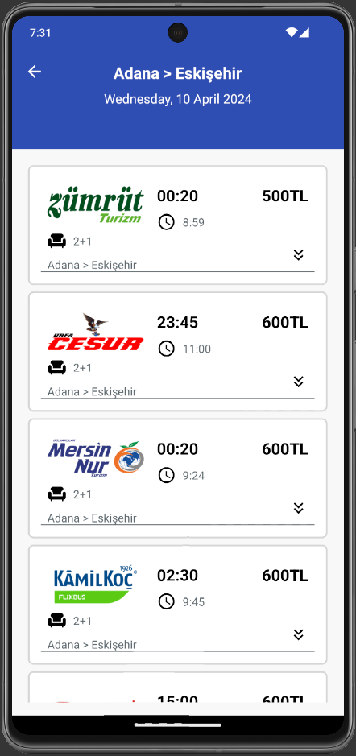
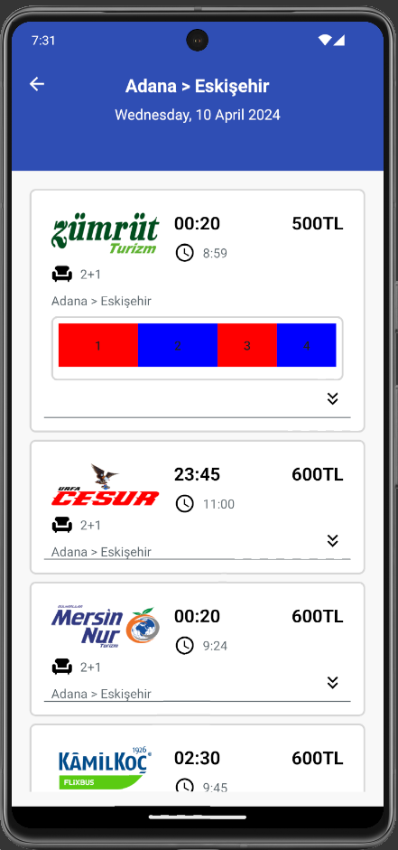

# obilet.com Native Mobile Developer Programming Assignment for Android Mid./Sr. Position
Developed an Android application that allows end users to select their desired origin & destination & departure date and displays available bus journeys for the specified query.

### Used Technologies and Libraries
* Clean Architecture & MVVM
* Multi-module structure
* Kotlin
* Kotlin Coroutines
* Dagger Hilt
* Jetpack Components ( Navigation, DataStore, Lifecycle, ViewModel )
* Coil Image Loading Library

### Screens

#### Index (Bus Section)

  
  

#### Index (Flight Section) and Query screen

  
  

#### Bus Journey Index

  
  

